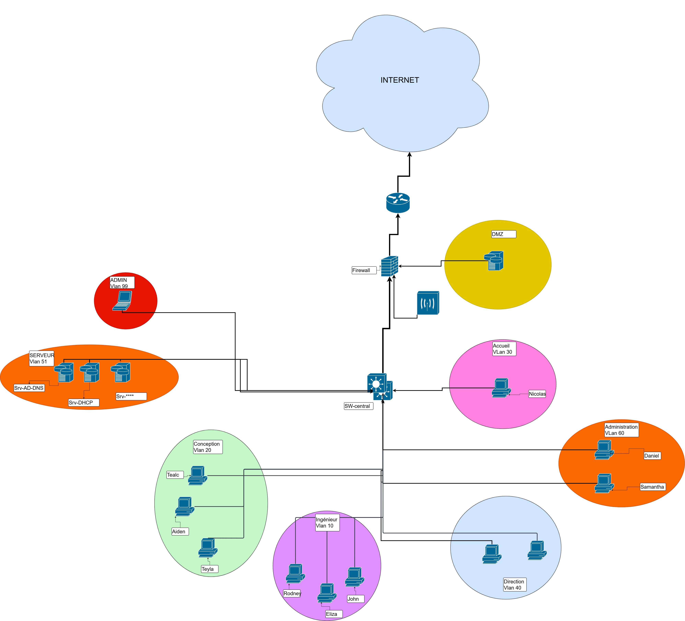

# EngineerAero — Infrastructure Souveraineté & Résilience

**Prestataire :** Stargate Système | **Projet :** TSSR 2025 | **Client :** EngineerAero (PME aéronautique, 20 ingénieurs)

---

## Contexte

EngineerAero stockait l'ensemble de ses plans 3D et dossiers d'appels d'offres sur un NAS en RAID 0, utilisé à 75 % de capacité, sans aucune tolérance aux pannes. La mission : concevoir une infrastructure complète, souveraine et conforme NIS2, capable de protéger ce patrimoine critique.

---

## Schéma réseau



---

## Stack technique

| Couche | Matériel / Logiciel | Détail |
|---|---|---|
| Stockage | Synology DS3622xs+ | RAID 6 — 48 To utiles, cache NVMe, 2x 10 GbE |
| Virtualisation | 2x 2CRSi OC-2100 + Proxmox VE | Cluster HA — basculement automatique en 60-120s |
| Réseau | 2x Alcatel-Lucent OS6560 | Virtual Chassis — 10 GbE, VLANs 10/20/30/40/51/60/99 |
| Sécurité | 2x Stormshield SN220 | Cluster HA — certifié ANSSI, IPS/IDS, VPN, DMZ |
| Sauvegarde | Hyper Backup + OVHcloud S3 | Règle 3-2-1-1-0 — Object Lock WORM anti-ransomware |
| Annuaire | Windows Server 2022 + AD | 20 comptes, GPO, DNS, DHCP |
| ITSM | GLPI + FusionInventory | Ticketing ITIL, inventaire automatisé |
| Messagerie | OVHcloud Hosted Exchange | Souverain FR, MFA, SPF/DKIM/DMARC |

---

## Indicateurs clés

| RPO | Budget CapEx | Conformité NIS2 |
|---|--|---|
| 4 heures | < 30 min | < 8 heures | 36 810 € HT | 9 / 11 critères |

---

## Segmentation réseau (VLANs)

| VLAN | Nom | Usage |
|---|---|---|
| 10 | Ingénieur | Postes bureau d'études |
| 20 | Conception | Postes CAO/DAO |
| 30 | Accueil | Réception, visiteurs |
| 40 | Direction | Postes direction |
| 51 | Serveur | AD, DNS, DHCP |
| 60 | Administration | RH, comptabilité |
| 99 | Management | Administration réseau, IPMI |
| DMZ | Zone démilitarisée | Services exposés internet |

---

## Sauvegarde 3-2-1-1-0

| Règle | Application |
|---|---|
| 3 copies | Production NAS + Snapshot 4h + Backup OVHcloud |
| 2 supports | Disques RAID 6 + Object Storage S3 |
| 1 hors site | OVHcloud Roubaix/Strasbourg — ISO 27001 |
| 1 immuable | Object Lock WORM — inaltérable même par un admin |
| 0 erreur | Vérification intégrité SHA-256 automatique |

---

## Déploiement — 5 phases (15 à 20 jours ouvrés)

1. **Préparation** — Audit réseau, plan d'adressage, réception matériel
2. **Installation** — Rack, câblage 10 GbE, Proxmox HA, Stormshield, NAS RAID 6, Active Directory
3. **Sauvegarde** — OVH S3, Object Lock WORM, Hyper Backup, test de restauration obligatoire
4. **Migration** — Transfert données depuis l'ancien NAS, vérification checksums SHA-256
5. **Services** — Exchange + MFA, site web SSL, GLPI, formation utilisateurs

---

## Structure du dépôt

```
engineeraero-infra/
├── README.md
├── docs/
│   ├── schema_reseau.png
│   ├── CDC_EngineerAero_v5.docx
│   └── checklist_validation.md
└── reseau/
    └── topologie.md
```

---

*Projet TSSR — Stargate Système — Avril 2025*
